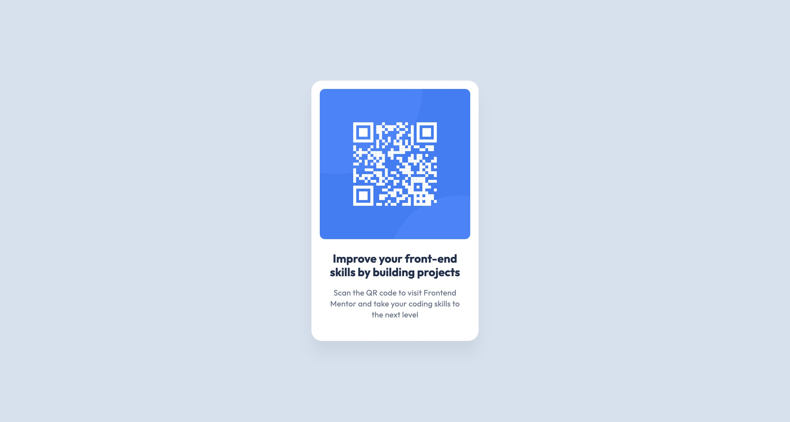

# Frontend Mentor - QR code component solution

This is a solution to the [QR code component challenge on Frontend Mentor](https://www.frontendmentor.io/challenges/qr-code-component-iux_sIO_H). Frontend Mentor challenges help you improve your coding skills by building realistic projects.

## Table of contents

- [Overview](#overview)
  - [Screenshot](#screenshot)
  - [Links](#links)
- [My process](#my-process)
  - [Built with](#built-with)
  - [What I learned](#what-i-learned)
  - [Continued development](#continued-development)
  - [Useful resources](#useful-resources)
- [Author](#author)
- [Acknowledgments](#acknowledgments)

## Overview

### Screenshot




### Links

- Solution URL: [Add solution URL here](https://github.com/yunxiaodao/portfolio/blob/main/frontend-mentor/qr-code-component-main/index.html)
- Live Site URL: [Add live site URL here](https://yunxiaodao.github.io/portfolio/frontend-mentor/qr-code-component-main/)

## My process

### Built with

- Semantic HTML5 markup
- CSS custom properties
- CSS flexbox
- Mobile-first workflow

### What I learned

Adding meta descriptions helps with SEO optimization.

```html
<meta name="description" content="QR code component" />
```

Setting an image to display: block can completely eliminate layout problems caused by its default inline nature (such as a stubborn gap at the bottom) and provide more stable and predictable size and positioning control.

```html

```

The height of the text block can be resolved by adjusting the line-height.

```css
.text-preset-1 {
  font-size: calc(22 * var(--unit));
  /* There is a 0.8px difference in height compared to the design draft. */
  /* line-heihgt: 1.2; */
  /* Best solution */
  line-height: 1.182;
}
```

### Continued development

- design
- components
- indie hacker

### Useful resources

## Author

- Website - [yunxiaodao](https://github.com/yunxiaodao/portfolio)
- Frontend Mentor - [@yunxiaodao](https://www.frontendmentor.io/profile/yunxiaodao)

## Acknowledgments
